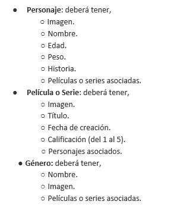
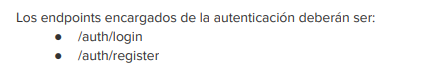
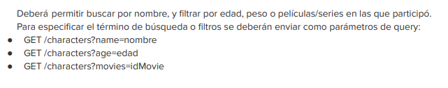
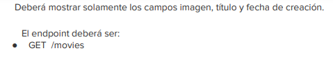
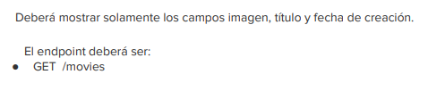
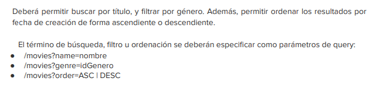

# disney-lab-challenge
Proyecto para el challenge de ingreso a la aceleración Alkemy

# Objetivo
Desarrollar una API para explorar el mundo de Disney, la cual permitirá conocer y modificar los
personajes que lo componen y entender en qué películas estos participaron. Por otro lado, deberá
exponer la información para que cualquier frontend pueda consumirla.
# Requerimientos técnicos
Requerimientos técnicos
1. Modelado de Base de Datos
   1. No es necesario crear las tablas, solo la base de datos con el nombre "disney", al ejecutar el api, JPA creará las tablas de forma automática
   2. En el archivo "properties" de la carpeta "resources" configure su nombre de base de datos MySQL, su ususario y en caso de tener contraseña, también. Pero si no tiene contraseña, deje ese campo vació.

2. Autenticación de usuarios
   Para realizar peticiones a los endpoints subsiguientes el usuario deberá contar con un token que
   obtendrá al autenticarse. Para ello, deberán desarrollarse los endpoints de registro y login, que
   permitan obtener el token.

3. Listado de Personaje

4. Detalle de Personaje
      En el detalle deberán listarse todos los atributos del personaje, como así también sus películas o
      series relacionadas
5. Búsqueda de Personajes

6. Listado de Películas

7. Listado de Películas

8. Detalle de Película con sus personajes:
   Devolverá todos los campos de la película o serie junto a los personajes asociados a la misma
9. Creación, Edición y Eliminación de Película / Serie
   Deberán existir las operaciones básicas de creación, edición y eliminación de películas o series.
10. Búsqueda de Películas

11. Envío de Emails
    Al registrarse en el sitio, el usuario deberá recibir un email de bienvenida. Es recomendable, la
    utilización de algún servicio de terceros como SendGrid
# Configuración email
1. Para generar el envío de emails deben configurar la variable global "EMAIL_API_KEY" con el apiKEY que se genera al registrarse en Sengrid. Así como el correo con el que se registran
2. Les brindo un enlace con la integración de sengrid + spring boot para que puedan configurarlo y entenderlo
3. Enlace: https://medium.com/javarevisited/sending-emails-with-sendgrid-and-spring-boot-81e9637a1f05
# Documentación Postman
1. Dentro de la carpeta "documentacion.postman" hay un archivo .json con las diferentes peticiones.